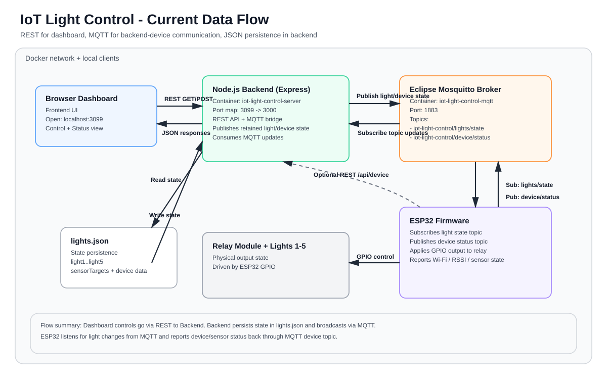

# IoT Light Control System

ระบบควบคุมไฟ 5 ดวงด้วย ESP32, Node.js, MQTT และ Docker Compose

## ภาพรวม

โปรเจกต์นี้แยกการสื่อสารออกเป็น 2 ส่วนหลัก:

- เว็บ Dashboard ใช้ REST API ของ Backend สำหรับสั่งเปิด/ปิดไฟ
- ESP32 ใช้ MQTT subscribe สถานะไฟและ publish สถานะอุปกรณ์

การออกแบบนี้ช่วยให้หน้าเว็บยังใช้งานง่าย แต่ฝั่งอุปกรณ์จริงคุยกับ backend ผ่าน MQTT แทนการ polling HTTP ตลอดเวลา

## Features

- ควบคุมไฟ 5 ดวงผ่านหน้าเว็บ
- เปิด/ปิดไฟรายดวงและเปิด/ปิดทั้งหมด
- ตั้งกลุ่มหลอดที่ให้ sensor ควบคุมได้
- เก็บสถานะล่าสุดไว้ในไฟล์ JSON
- ส่งสถานะอุปกรณ์ ESP32 ผ่าน MQTT
- รันทั้งระบบด้วย Docker Compose ได้ในคำสั่งเดียว

## Architecture

```text
Browser Dashboard
  │ REST API
  ▼
Node.js Backend (Express)
  │ publish / subscribe
  ▼
Mosquitto MQTT Broker
  │ retained light/device state
  ▼
ESP32 Firmware
  │ GPIO
  ▼
Relay Module 5 Channel
  │
  ▼
Light 1-5
```

## Data Flow Diagram



## Project Structure

```text
iot-light-control/
├── backend/
│   ├── server.js
│   ├── package.json
│   ├── package-lock.json
│   └── lights.json
├── frontend/
│   ├── index.html
│   ├── script.js
│   └── style.css
├── esp32/
│   ├── esp32_light_control.ino
│   ├── esp32_light_controlnorelay.ino
│   ├── final_home.ino
│   └── esp32_mqtt_light_control.ino
├── mqtt/
│   └── mosquitto.conf
├── docker-compose.yml
└── README.md
```

## Requirements

- Docker และ Docker Compose
- Node.js 18+ ถ้าจะรัน backend แบบ local
- Arduino IDE หรือ PlatformIO สำหรับอัปโหลดโค้ด ESP32
- ESP32 Development Board
- Relay Module 5 Channel
- LED หรือโหลดจริงสำหรับทดสอบ

## Run With Docker Compose

รันคำสั่งนี้จากโฟลเดอร์โปรเจกต์หลัก:

```bash
docker compose up --build
```

บริการที่เปิดขึ้นมาจะมี:

- Backend: http://localhost:3099
- MQTT Broker: tcp://localhost:1883

หมายเหตุ: ใน Docker Compose โปรเจกต์นี้ map พอร์ต backend ออกเป็น `3099` ไม่ใช่ `3000`

## Run Backend Locally

ถ้าต้องการรัน backend แยกจาก Docker:

```bash
cd backend
npm install
npm start
```

โดยค่าเริ่มต้น backend จะฟังที่พอร์ต `3000`

ถ้าจะให้ backend ต่อ broker อื่น ให้ตั้งค่า environment เพิ่ม:

```bash
MQTT_URL=mqtt://localhost:1883
MQTT_LIGHT_TOPIC=iot-light-control/lights/state
MQTT_DEVICE_TOPIC=iot-light-control/device/status
```

## Open Dashboard

- ถ้ารันผ่าน Docker Compose: http://localhost:3099
- ถ้ารัน backend แบบ local: http://localhost:3000

## ESP32 Setup

เปิดไฟล์ [esp32/esp32_mqtt_light_control.ino](esp32/esp32_mqtt_light_control.ino) แล้วแก้ค่าเหล่านี้:

```cpp
const char* ssid = "YOUR_WIFI_NAME";
const char* password = "YOUR_WIFI_PASSWORD";
const char* mqttHost = "192.168.x.x";
```

`mqttHost` ต้องเป็น IP ของเครื่องที่รัน Docker Compose หรือ broker จริง ห้ามใช้ `localhost`

## Upload Steps

1. เปิด Arduino IDE
2. เปิดไฟล์ [esp32/esp32_mqtt_light_control.ino](esp32/esp32_mqtt_light_control.ino)
3. ติดตั้ง library ที่โค้ดต้องใช้ถ้ายังไม่มี
4. เลือก Board เป็น ESP32 Dev Module
5. เลือก Port ที่เชื่อมกับบอร์ด
6. กด Upload
7. เปิด Serial Monitor ที่ baud rate 115200

## Wiring

| Relay Module | ESP32 GPIO |
| --- | --- |
| IN1 | GPIO 23 |
| IN2 | GPIO 22 |
| IN3 | GPIO 21 |
| IN4 | GPIO 19 |
| IN5 | GPIO 18 |
| VCC | 5V |
| GND | GND |

ต้องต่อ GND ของ ESP32 และ Relay ร่วมกัน

## MQTT Topics

Backend และ ESP32 ใช้ topic หลัก 2 ตัว:

- `iot-light-control/lights/state`
- `iot-light-control/device/status`

แนวทาง payload โดยสรุป:

- lights state: `light1` ถึง `light5`, `sensorTargets`, `source`, `updatedAt`
- device status: `ssid`, `ip`, `rssi`, `lastSeen`, `lightSensor`, `isDark`, `source`, `updatedAt`

## API

### GET /api/lights
ดึงสถานะไฟทั้งหมดรวม device status และ sensor config

### GET /api/lights/:id
ดึงสถานะไฟดวงที่ `1-5`

### POST /api/lights/:id/:state
เปิดหรือปิดไฟดวงเดียว

### POST /api/lights/all/:state
เปิดหรือปิดไฟทั้งหมด

### POST /api/lights/sensor-config
กำหนดหลอดที่ให้ sensor ควบคุม โดยส่ง `{ "sensorTargets": [1,2] }`

### GET /api/lights/sensor-config
ดูรายการหลอดที่ผูกกับ sensor

### POST /api/lights/sensor/:state
ESP32 ใช้สั่งไฟของหลอดที่อยู่ใน sensorTargets เป็น `on` หรือ `off`

### POST /api/device
อัปเดตสถานะอุปกรณ์ ESP32

### GET /api/device
ดึงสถานะอุปกรณ์ ESP32 ล่าสุด

## Test Flow

1. รัน `docker compose up --build`
2. เปิด Dashboard ที่ `http://localhost:3099`
3. กดเปิด/ปิดไฟจากหน้าเว็บ
4. ตรวจสอบว่า `lights.json` เปลี่ยนตาม
5. อัปโหลด ESP32 sketch แบบ MQTT แล้วดู Serial Monitor ว่าต่อ Wi-Fi และ MQTT ได้
6. ตรวจสอบว่า relay สลับตามสถานะไฟในหน้าเว็บ

## Troubleshooting

| ปัญหา | วิธีตรวจสอบ |
| --- | --- |
| Dashboard เปิดไม่ได้ | เช็กว่า compose รันอยู่ และเข้า `http://localhost:3099` |
| ESP32 ต่อ broker ไม่ได้ | ตรวจสอบ `mqttHost` และพอร์ต `1883` |
| ไฟไม่เปลี่ยนตามหน้าเว็บ | ดู log backend และตรวจสอบว่า ESP32 subscribe topic ถูกต้อง |
| สถานะ device ไม่ขึ้น | ตรวจสอบว่า ESP32 publish ไปที่ `iot-light-control/device/status` |
| Relay ทำงานกลับด้าน | Relay ส่วนใหญ่เป็น Active LOW |
| GND ไม่ตรงกัน | ต่อ GND ของ ESP32 กับ Relay ให้ร่วมกัน |

## Notes

- โค้ด backend ยังคงใช้ REST สำหรับหน้าเว็บ เพื่อให้ใช้งานง่ายและไม่กระทบ UI เดิม
- MQTT ใช้กับ backend ↔ ESP32
- ถ้าจะต่อกับไฟบ้านจริง ควรให้ผู้เชี่ยวชาญดูแลเรื่องความปลอดภัยไฟฟ้า

## Next Ideas

- เพิ่ม login/authentication
- เพิ่ม scheduling เปิด/ปิดอัตโนมัติ
- ย้าย persistence จาก JSON ไป SQLite
- เพิ่ม WebSocket สำหรับ real-time UI
