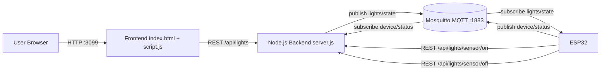

# IoT Light Control System (Final)

## 1) Overview
ระบบนี้เป็น Smart Home Mini ที่ควบคุมไฟ 5 ดวงผ่านเว็บ และรองรับโหมด "เลือกหลอดที่ให้ Sensor คุม" ได้รายดวง

- ควบคุมจาก Web: เปิด/ปิดรายดวง, เปิด/ปิดทั้งหมด
- โหมด Sensor: เลือกหลอดที่ให้ sensor คุมได้จากหน้าเว็บ
- ESP32 รับคำสั่งผ่าน MQTT
- Backend เป็นตัวกลางเก็บสถานะ + publish ไป MQTT

## 2) Overview Flow
1. ผู้ใช้กดปุ่มบนเว็บ
2. Frontend เรียก REST API ไป Backend (`/api/lights/...`)
3. Backend บันทึกสถานะไฟลง `lights.json`
4. Backend publish สถานะไฟไป MQTT topic `iot-light-control/lights/state`
5. ESP32 subscribe topic นี้ และสั่ง GPIO/Relay ตามสถานะ
6. ESP32 ส่ง device status กลับ topic `iot-light-control/device/status`
7. Backend sync ข้อมูล device เพื่อแสดงบน Dashboard

## 3) Data Flow / Service Architecture



### Topics / Endpoints สำคัญ
- MQTT
  - `iot-light-control/lights/state`
  - `iot-light-control/device/status`
- REST
  - `POST /api/lights/:id/:state`
  - `POST /api/lights/all/:state`
  - `POST /api/lights/sensor-config`
  - `POST /api/lights/sensor/:state`
  - `GET /api/lights`

## 4) อุปกรณ์ที่ใช้
- ESP32 DevKit V1 (Wi‑Fi MCU)
- LED 5 ดวง (แทนโหลดไฟ)
- โมดูลรีเลย์ 2 ช่อง 5V (ควบคุมโหลดจริง)
- โมดูลเซนเซอร์แสง (LDR + comparator)
- สาย jumper, breadboard, แหล่งจ่ายไฟ
- บ้านโมเดล (สำหรับงานนำเสนอ/เดโม่)

## 5) Circuit Diagram (Logical)

```text
                    +-----------------------------+
                    |         ESP32 DevKit        |
                    |                             |
Light 1 GPIO23 -----+--> LED1                     |
Light 2 GPIO22 -----+--> LED2                     |
Light 3 GPIO21 -----+--> LED3                     |
Light 4 GPIO19 -----+--> LED4                     |
Light 5 GPIO18 -----+--> LED5                     |
                    |                             |
Relay1 GPIO26 ------+--> Relay CH1 (Light1 load)  |
Relay2 GPIO27 ------+--> Relay CH2 (Light2 load)  |
                    |                             |
LDR DO GPIO34 <-----+--- LDR Sensor DO            |
                    +-----------------------------+

MQTT Broker <----Wi‑Fi----> ESP32
Web <----HTTP----> Backend <----MQTT----> ESP32
```

> หมายเหตุ: Logic ON/OFF ของ Relay/Sensor อาจเป็น Active-LOW หรือ Active-HIGH ตามบอร์ดจริง

## 6) การทำงานโหมด Sensor รายดวง
1. ผู้ใช้ติ๊ก checkbox "ใช้ Sensor แสง" ที่หลอดที่ต้องการบนเว็บ
2. Frontend ส่ง `sensorTargets` ไป `POST /api/lights/sensor-config`
3. ESP32 อ่านค่า sensor เป็นช่วงเวลา
4. เมื่อสถานะ "มืด/สว่าง" เปลี่ยน ESP32 เรียก
   - มืด: `POST /api/lights/sensor/on` (หรือ off ตาม calibration)
   - สว่าง: `POST /api/lights/sensor/off`
5. Backend เปลี่ยนเฉพาะหลอดที่อยู่ใน `sensorTargets` และ publish ไป MQTT

## 7) ความสะดวกสบายในการใช้งาน
- ควบคุมผ่านมือถือได้ทันทีจาก Browser
- รองรับ Manual + Auto (sensor) พร้อมกัน
- ตั้งค่า Wi‑Fi ที่ ESP32 ได้เมื่อบูตแล้วเชื่อมต่อไม่ได้ (Config Portal)
- ระบบแยกชั้นชัดเจน (Web / API / MQTT / Device) ง่ายต่อ debug และขยายระบบ

## 8) ราคาประมาณอุปกรณ์ (ตลาดไทย)
> ราคาเป็นช่วงประมาณการ (ขึ้นกับร้าน/โปรโมชัน/ช่วงเวลา)

- ESP32 DevKit V1: ~120–220 บาท
- LED 5mm x5: ~5–25 บาท (ถ้าซื้อแยก), หรือแพ็ก ~80–100 บาท/100 ดวง
- LDR Sensor Module: ~20–40 บาท
- Relay Module 2CH 5V: ~70–130 บาท
- บ้านโมเดล (งาน DIY/งานเรียน): ~150–600 บาท (ขึ้นกับวัสดุและขนาด)

### แหล่งอ้างอิงราคา (ตัวอย่าง)
- ESP32 DevKit V1 (173 บาท): https://thaipick.com/product/shopee/1581371
- LDR Sensor Module (30 บาท): https://www.genlogic.co.th/product/tag/photoresistor-ldr-light-sensor-module
- Relay 2CH 5V (98 บาท): https://www.mcucity.com/product/702/2-channel5v-omron-ssr-high-level-solid-state-relay-module-250v-2a-for-arduino
- LED 5mm (เช่น 5 บาท/ดวง): https://www.3e-thailand.com/products_detail/view/7320307
- LED 5mm pack100 (100 บาท): https://gentechled.com/product/led-5mm-%E0%B9%80%E0%B8%AB%E0%B8%A5%E0%B8%B7%E0%B8%AD%E0%B8%87%E0%B9%83%E0%B8%AA-pack100/

## 9) สรุป
ระบบนี้พร้อมใช้งานจริงในสเกลงานเรียน/เดโม่: ควบคุมไฟผ่านเว็บได้, ใช้ MQTT เป็น event bus, และรองรับ sensor control แบบเลือกเป็นรายหลอดได้ครบ.
